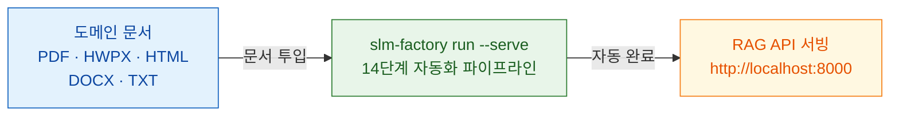

<div align="center">

# slm-factory

### 문서 넣고, 명령어 하나, RAG API 서빙

도메인 문서만 넣으면 **SLM 학습부터 RAG API 서버까지** 한 번에.<br>
할루시네이션 없는 도메인 AI 서비스를 즉시 구축합니다.

<sub>14단계 자동화 파이프라인 · LoRA 파인튜닝 · Ollama 원클릭 배포 · RAG API 서빙</sub>

<br>

[사용 가이드](https://devdna.github.io/slm-factory/guide.html) · [CLI 레퍼런스](https://devdna.github.io/slm-factory/cli-reference.html) · [기술 확장 가이드](https://devdna.github.io/slm-factory/integration-guide.html)

</div>

<br>



## 빠른 시작

### 1. 준비

```bash
# 설치
git clone https://github.com/DevDnA/slm-factory.git
cd slm-factory
python3 -m venv .venv && source .venv/bin/activate
pip install -e ".[all]"

# Ollama 준비 (별도 터미널)
ollama serve
ollama pull qwen3:8b

# 프로젝트 생성 + 문서 추가
slm-factory init my-project
cp /path/to/documents/*.pdf my-project/documents/
```

### 2. 실행 — 명령어 하나로 전체 파이프라인 + RAG 서버

```bash
slm-factory run --serve --config my-project/project.yaml
```

> 14단계 파이프라인(파싱 → QA 생성 → 검증 → 학습 → Ollama 배포 → RAG 인덱싱)이 자동으로 실행되고, 완료 후 RAG API 서버가 자동으로 시작됩니다.

### 3. 확인 — API로 즉시 질의

```bash
curl -X POST http://localhost:8000/v1/query \
  -H "Content-Type: application/json" \
  -d '{"query": "우리 회사 휴가 정책은?"}'
```

```json
{
  "answer": "연차 휴가는 입사 1년 후 15일이 부여되며...",
  "sources": [
    {"content": "제15조(연차휴가) 입사 1년 후 15일...", "doc_id": "인사규정.pdf-chunk-0", "score": 0.85}
  ],
  "query": "우리 회사 휴가 정책은?"
}
```

> 대화형 설정이 필요하면 `slm-factory tool wizard --config project.yaml`을 사용할 수 있습니다.

## 무엇을 해결하는가

| 문제 | slm-factory + RAG |
|------|-------------------|
| 범용 LLM은 도메인을 모른다 | 도메인 문서로 직접 학습한 SLM이 전문 지식을 내재화 |
| LLM API 비용이 계속 발생 | 로컬 SLM 추론, GPU 서버 한 대면 충분 |
| 사내 문서가 외부로 유출 | 온프레미스 완전 격리, 데이터 유출 제로 |
| 할루시네이션이 신뢰를 깎는다 | RAG 검색 근거 + SLM 도메인 지식 = 할루시네이션 차단 |

## 문서

> **[devdna.github.io/slm-factory](https://devdna.github.io/slm-factory/)**

| 문서 | 내용 |
|------|------|
| [사용 가이드](https://devdna.github.io/slm-factory/guide.html) | 설치, 튜토리얼, 트러블슈팅 |
| [기술 확장 가이드](https://devdna.github.io/slm-factory/integration-guide.html) | RAG 기술 조합 전략, 연동 방법 |
| [빠른 참조](https://devdna.github.io/slm-factory/quick-reference.html) | 명령어 치트시트 |
| [CLI 레퍼런스](https://devdna.github.io/slm-factory/cli-reference.html) | 전체 명령어 옵션 |
| [설정 레퍼런스](https://devdna.github.io/slm-factory/configuration.html) | project.yaml 전체 설정 |
| [아키텍처](https://devdna.github.io/slm-factory/architecture.html) | 설계 철학, 패턴, 데이터 흐름 |
| [개발 가이드](https://devdna.github.io/slm-factory/development.html) | 모듈 확장, 기여 방법 |

## 시스템 요구사항

- **Python** 3.11+
- **GPU** — NVIDIA CUDA (8GB+) / Apple Silicon (MPS) / CPU 폴백
- **Ollama** — [ollama.com](https://ollama.com)

## 라이선스

추후 결정
