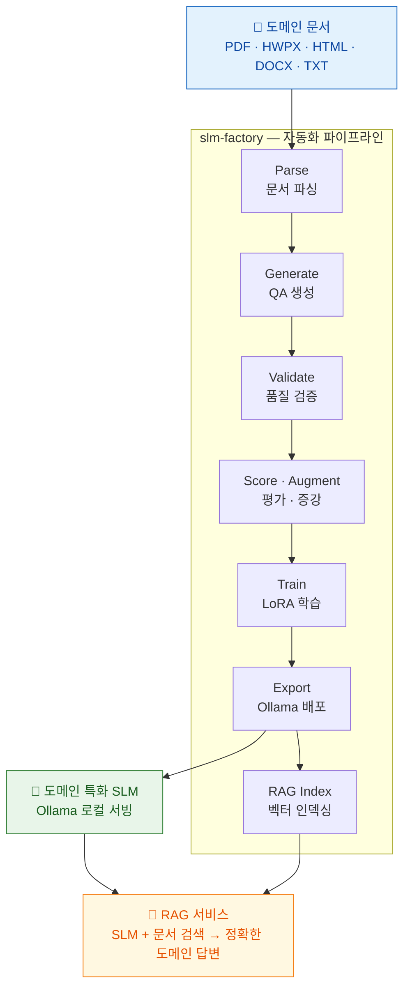

<div align="center">

# slm-factory

### 📄 도메인 문서 → 🤖 특화 SLM → 💬 RAG 서비스

도메인 문서만 넣으면 **소형 언어모델(SLM)**이 자동으로 만들어지고,<br>
**RAG**와 결합하여 할루시네이션 없는 도메인 AI 서비스를 즉시 구축합니다.

<sub>Teacher-Student 지식 증류 · LoRA 파인튜닝 · Ollama 원클릭 배포 · AutoRAG 연동</sub>

<br>

[사용 가이드](https://devdna.github.io/slm-factory/guide.html) · [CLI 레퍼런스](https://devdna.github.io/slm-factory/cli-reference.html) · [기술 확장 가이드](https://devdna.github.io/slm-factory/integration-guide.html)

</div>

<br>



> **도메인 문서 하나의 입력**으로 ① 도메인 특화 SLM 생성 ② RAG 서비스 구축 — 두 가지를 동시에 달성합니다.

## 무엇을 해결하는가

| 문제 | slm-factory + RAG |
|------|-------------------|
| 범용 LLM은 도메인을 모른다 | 도메인 문서로 직접 학습한 SLM이 전문 지식을 내재화 |
| LLM API 비용이 계속 발생 | 로컬 SLM 추론, GPU 서버 한 대면 충분 |
| 사내 문서가 외부로 유출 | 온프레미스 완전 격리, 데이터 유출 제로 |
| 할루시네이션이 신뢰를 깎는다 | RAG 검색 근거 + SLM 도메인 지식 = 할루시네이션 차단 |

## 빠른 시작

```bash
# 설치
git clone https://github.com/DevDnA/slm-factory.git
cd slm-factory
python3 -m venv .venv && source .venv/bin/activate
pip install -e ".[all]"

# Ollama 준비
ollama serve                # 별도 터미널
ollama pull qwen3:8b        # Teacher 모델 (8GB VRAM) 또는 qwen3.5:9b (24GB+)

# 실행
slm-factory init my-project
cp /path/to/documents/*.pdf my-project/documents/
slm-factory tool wizard --config my-project/project.yaml

# 또는 원클릭 파이프라인 + RAG 서버 자동 시작
slm-factory run --serve --config my-project/project.yaml
```

> wizard가 문서 선택부터 파싱, QA 생성, 검증, 학습, Ollama 배포, 모델 평가, RAG 인덱싱까지 14단계를 안내합니다.

## 주요 기능

- **다중 형식 파싱** — PDF, HWPX(한글), HTML, TXT/MD, DOCX
- **Teacher-Student 증류** — Ollama(로컬) 또는 OpenAI 호환 API로 QA 자동 생성
- **QA 검증 + 품질 평가** — 규칙/임베딩 필터링, LLM 1~5점 평가
- **데이터 증강** — 질문 패러프레이즈로 학습 데이터 확장
- **LoRA 파인튜닝** — 효율적 학습 + 조기 종료
- **Ollama 원클릭 배포** — Modelfile 자동 생성, 즉시 서빙
- **RAG 서비스** — `--serve` 플래그로 파이프라인 완료 후 RAG API 서버 자동 시작
- **자동 진화** — `tool evolve` 한 번으로 증분→학습→품질게이트→배포
- **TUI** — QA 리뷰, 파이프라인 대시보드

## 문서

> **[devdna.github.io/slm-factory](https://devdna.github.io/slm-factory/)**

| 문서 | 내용 |
|------|------|
| [사용 가이드](https://devdna.github.io/slm-factory/guide.html) | 설치, 튜토리얼, 트러블슈팅 |
| [기술 확장 가이드](https://devdna.github.io/slm-factory/integration-guide.html) | RAG 기술 조합 전략, 연동 방법 |
| [빠른 참조](https://devdna.github.io/slm-factory/quick-reference.html) | 명령어 치트시트 |
| [CLI 레퍼런스](https://devdna.github.io/slm-factory/cli-reference.html) | 전체 명령어 옵션 |
| [설정 레퍼런스](https://devdna.github.io/slm-factory/configuration.html) | project.yaml 전체 설정 |
| [아키텍처](https://devdna.github.io/slm-factory/architecture.html) | 설계 철학, 패턴, 데이터 흐름 |
| [개발 가이드](https://devdna.github.io/slm-factory/development.html) | 모듈 확장, 기여 방법 |

## 시스템 요구사항

- **Python** 3.11+
- **GPU** — NVIDIA CUDA (8GB+) / Apple Silicon (MPS) / CPU 폴백
- **Ollama** — [ollama.com](https://ollama.com)

## 라이선스

추후 결정
